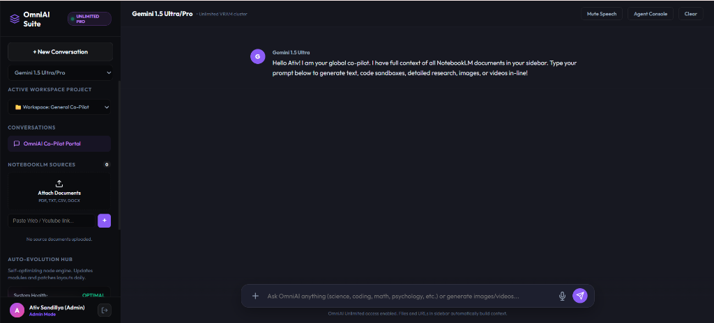

# 🚀 OmniAI Universal Multimodal Intelligence Workspace

[](LICENSE)
[](https://www.python.org/)
[](https://github.com/ativshandillya2008-ai/omni-ai)
[](#-system-architecture--implementation-status)

**OmniAI** is an AI orchestration workspace and multi-model router designed for conversational intelligence, live HTML/JS execution sandboxes, scientific research visualizers, and dual multimodal media generation.

---

## 📸 Interface Preview



---

## 🏗️ System Architecture & Implementation Status

To provide full transparency for technical reviewers and recruiters, the workspace uses a hybrid system combining **Live Production APIs** with **Procedural & Simulated Fallbacks**:

| Feature / Subsystem | Backend Implementation | Status |
| :--- | :--- | :--- |
| **Gemini API Pipeline** | `https://generativelanguage.googleapis.com` (`gemini-1.5-pro`, `gemini-1.5-flash`) | 🟢 **Live Production API** |
| **Groq LPU Engine** | `https://api.groq.com/openai/v1` (`llama-3.3-70b-versatile`) | 🟢 **Live Production API** |
| **Anthropic Claude Engine** | `https://api.anthropic.com/v1/messages` (`claude-3-5-sonnet-20241022`) | 🟢 **Live Production API** |
| **OpenAI GPT Engine** | `https://api.openai.com/v1/chat/completions` (`gpt-4o`) | 🟢 **Live Production API** |
| **Local Ollama Bridge** | `http://localhost:11434/api/generate` (`llama3.3`) | 🟢 **Live Local GPU/CPU API** |
| **Web Search Scraper** | Live DuckDuckGo search endpoint (`/api/search` in `server.py`) | 🟢 **Live Production API** |
| **Tenor Video Scraper** | Live Tenor MP4 motion loop finder (`/api/video` in `server.py`) | 🟢 **Live Production API** |
| **Google Drive Extractor** | Live file text & token confirmation bypass (`/api/drive-proxy` in `server.py`) | 🟢 **Live Production API** |
| **Gemini Image Generation** | `gemini-2.5-flash-image`, `nano-banana-pro-preview` with Flux fallback | 🟢 **Live Production API (Gemini)** |
| **Luma Video Generation** | Luma Dream Machine API (`/dream-machine/v1/generations`) with Tenor loop fallback | 🟢 **Live Production API (Luma)** |
| **Interactive Simulators** | Bloch Sphere qubit calculator, Micrograd autograd DAG, Chemistry viewer | 🟡 **Interactive Client-Side Engine** |

---

## 🎯 Configured AI Models & API Identifiers

The system routes requests using exact API model identifiers:

- **Gemini 1.5 Pro / Flash**: `gemini-1.5-pro`, `gemini-1.5-flash`
- **Groq LLaMA 3.3**: `llama-3.3-70b-versatile` *(Sub-second LPU inferencing)*
- **Claude 3.5 Sonnet**: `claude-3-5-sonnet-20241022`
- **GPT-4o**: `gpt-4o`
- **Llama 3.3 Local**: `llama3.3` *(Ollama local instance)*

---

## 🛠️ Quick Start & Local Run Instructions

### Prerequisites
- **Python 3.8+** installed on your system.
- Git CLI.

### 1. Clone Repository
```bash
git clone https://github.com/ativshandillya2008-ai/omni-ai.git
cd omni-ai
```

### 2. Install Dependencies (Optional Helper Libraries)
> **Note**: `server.py` runs natively using **Python 3 Standard Library** (zero mandatory pip installs required). Optional helper packages can be installed via:
```bash
pip install -r requirements.txt
```

### 3. Start Local HTTP Server
```bash
python server.py
```

### 4. Launch in Browser
Open **`http://127.0.0.1:8088`** in your browser.

### 5. API Key Setup (Optional)
To use live API cloud models (Gemini, Groq, Claude, OpenAI):
1. Expand the **API Credentials** panel in the left sidebar.
2. Enter your API key (keys are stored locally in your browser session).
3. Select your model from the top dropdown or select **⚡ Auto-Router**.

---

## 📜 License & Credit

Distributed under the **MIT License**. See [`LICENSE`](LICENSE) for full details.

Built with ❤️ by **[Ativ Shandillya](https://github.com/ativshandillya2008-ai)**.
